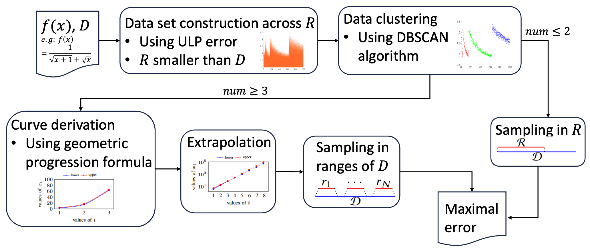
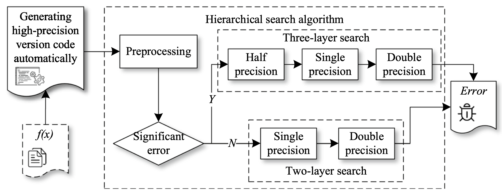

This page collects a(n incomplete) list of open-source projects that Zuoyan Zhang has ever involved in or currently participates in.

---

    
    

        <h2>Eiffel</h2>
        

             Eiffel is a tool used to detect significant floating-point errors. Instead of search such significant floating-point errors, Eiffel infers the input ranges that triggers such errors via polynomial extrapolation. The input ranges inferred by Eiffel can work with program rewrite engines like Herbie.
             The architecture decipts how Eiffel works, and the open-source repository is available at <a href="https://github.com/zuoyanzhang/Maxfpeed">GitHub</a>. The related paper was published and presented at <a href="https://ieeexplore.ieee.org/document/10298397">ASE 2023</a>.
        

    

---

    
    

        <h2>HSED</h2>
        

            HSED is implemented by using hierarchical search to detect the maximum error of floating-point arithmetic expressions. The core idea of HSED is to use the lower precision below the original input precision to guide the search, quickly locate the error hotspots, and use the high precision layer to increase the sampling of the extremely samll intervals that cause the error hotpots to obtain more accurate error results.
            The architecture decipts how HSED works, and the open-source repository is available at <a href="https://github.com/zuoyanzhang/HSED">GitHub</a>.. The related paper was published and presented at <a href="https://dl.acm.org/doi/10.1007/s11227-023-05523-6">TJSC</a>.
        

    

